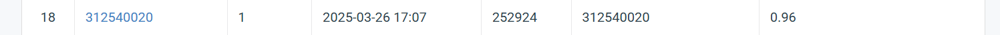

# Visual-Recognitionusing-Deep-Learning-2025-Spring
#ID: 312540020

## Introduction
This project focuses on handling data imbalance and enhancing feature extraction for **ResNet**, rather than simply using a deeper model.  
To achieve this, I employ **ResNetaa101D**, which has approximately **44.6M parameters**.  

### 🔹 Key Enhancements:  
- **Data Augmentation**  
- **Focal Loss**  
- **Anti-Aliasing**  
- **Label Smoothing**  

## Training 
The training code will save the prediction.csv base on the best checkpoint.
!python train.py

## Val
To get the confusion matrix on validation dataset.
!python val.py

## Performance Snapshot
  
